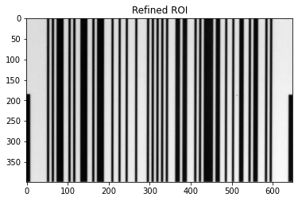

# Barcodes-verification
Verification of linear barcodes print quality according to ISO/IEC15416 specifications, using Image Processing and Computer Vision techniques.

For more theoretical information, check out the following documents.
- `Linear Barcodes Verification Project.pdf`: description of the project assignment.
- `guide-barcode-verification.pdf`: description of linear barcodes print quality verification.
- `report.pdf`: description of the solution.

Instead, for an in-depth view of the functions interfaces, check out the documentation and the doc-strings.

## Description
Given an image containing a barcode, the task consists in verifying the print quality of the barcode, by computing some quality parameters. 

Since the the barcode in the input image can be rotated and can have different scales and since the input image can contain other objects apart from the barcode, the quality parameters must be computed on a standardized image. We refer to this image as "refined ROI image", since it perfectly fits the Region Of Interest (i.e. the barcode) and it is refined according to some standards. More specifically, the refined ROI image is the sub-image of the input image which has the following properties.
- It contains the barcode, and the bars are perfectly vertical.
- Along the width, there are exactly $10*X$ pixels before the first barcode bar and after the last barcode bar, where $X$ is the minimum width of a bar.
- Along the height, it perfectly fits the bar with smallest height. Basically, the height of the refined ROI image is equal to the minimum height of a barcode bar. 

<p align="center">
  
  
  
</p>

*These images refer to the image 'UPC#01'.*

Then, the print quality parameters are computed. For computing the quality parameters, $10$ equally spaced horizontal lines are considered in the refined ROI image.
<p align="center">
  
</p>

The quality parameters are computed one each scanline, by considering the *scan reflectance profile*, and they are the following.
- Minimum reflectance, i.e. $R_{\text{min}}$.
- Symbol Contrast, i.e. $SC$. For computing it, also the maximum reflectance, i.e. $R_{\text{max}}$, is taken into account.
- Minimum Edge Contrast, i.e. $EC_{\text{min}}$.
- Modulation, i.e. $M$.
- Defect, i.e. $D$. For computing it, also the maximum Element Reflectance Non-uniformity, i.e. $ERN_{\text{max}}$, is taken into account.
<p align="center">
  
</p>

For each of these parameters, a numerical value is computed, and a symbolic grade between 'A' and 'F' is assigned, by using specific rules ('A' means very good, 'F' means very bad). 
In addition, a symbolic grade and a numerical value are assigned to the whole scanline.

Finally, an overall symbolic grade and an overall numerical value are assigned to the whole barcode.

## Dataset
Set of images containing barcodes, on which the application can be tested. Also an excel file containing the true quality parameters of these images is present. This dataset has been provided by DATALOGIC. 

### General overview
Different kinds of barcodes are present. In addition, there are images in which the barcode is particularly rotated or scaled. There are also images in which the barcode has the bars which are horizontally aligned instead of vertically.
<p align="center">
  
  
  
  
</p>

### Bad contrast images
There are images in which the contrast, i.e. $SC$, is particularly bad on purpose. 
<p align="center">
  
</p>
More specifically, five images are particularly interesting for $SC$, since its grade ranges from 'A' to 'F'. 
<p align="center">
  
  
  
  
  
</p>

### Bad modulation images
There are images in which the modulation, i.e. $M$, is particularly bad on purpose. For obtaining a bad $M$, an artifact has been added to the barcode, whose purpose is to decrease the intensity change between a bar and a space.

More specifically, five images are particularly interesting for $M$, since its grade ranges from 'A' to 'F'. 
<p align="center">
  
  
  
  
  
</p>

### Bad defect images
Finally, there are images in which the defect, i.e. $D$, is particularly bad on purpose. For obtaining a bad $D$, a "fake vertical bar" has been added to the barcode, either inside a space or a bar, for increasing the range of different intensities inside that barcode element. This "fake vertical bar" is called *defect*, and it can be either inside a space, i.e. *defect spot*, or inside a bar, i.e. *defect void*.
<p align="center">
  
  
</p>

More specifically, five images are particularly interesting for $D$, since its grade ranges from 'A' to 'F', due to a defect spot.
<p align="center">
  
  
  
  
  
</p>

Furthermore, other five images have $D$ which ranges from 'A' to 'F', but due to a defect void.
<p align="center">
  
  
  
  
  
</p>

## Approach
For solving our problem, a process consisting in four subsequent operations is implemented. For more information, see the report of this project. *The following shown examples are about the image 'UPC#01'.*
1) **Detect the bounding box.**
The bounding box surrounding the barcode in the input image is detected. 
<p align="center">
  
</p>

2) **Rotate the bounding box.** The image and the bounding box are rotated such that the barcode bars are now perfectly vertical.
From this operation, the ROI image is computed, which is the sub-image containing the barcode, with the bars perfectly vertical. Basically, the ROI image is the rotated image cropped around the rotated barcode. *Remark: the ROI image is gray-scale.*
<p align="center">
  
</p>

3) **Refine the ROI image.** The ROI image is refined, according to the standard explained before.
    - Along the width, the refined ROI image is such that there are exactly 10*X pixels before the first barcode bar and after the last barcode bar.
    - Along the height, the ROI image is refined in order to perfectly fit the bar with smallest height.

In order to perform this refinement, the precise and complete structure of the barcode is computed: every dimension about each bar is computed. 
<p align="center">
  
  
  
</p> 

4) **Compute the quality parameters**
Finally, the quality parameters of the barcode are computed, on the refined ROI image.
As explained before, the following quality parameters are computed on each scanline:
    - $R_{\text{min}}$, with also its symbolic grade
    - $SC$, with also its symbolic grade
    - $EC_{\text{min}}$, with also its symbolic grade
    - $M$, with also its symbolic grade
    - $ERN_{\text{max}}$, with also its symbolic grade
    - $D$, with also its symbolic grade
    - Symbolic grade and numerical value for the entire scanline

<p align="center">
  
  
</p> 

Finally, an overall symbolic grade and an overall numerical value are assigned to the whole barcode.

## Output file
According to the project description, an excel output file must be generated, containing the information and results of the applied process.

In particular, the information is structured in the following sheets.
- **Global quantities.** It contains the following information.
    * Name of the image
    * Bounding box coordinates
    * Centre of the bounding box
    * Angle of the rotation
    * $X$ dimension (i.e. minimum width of a barcode bar)
    * Height of the barcode (i.e. minimum height of a barcode bar)
    * Overall symbolic grade of the barcode
- **Bars/spaces widths** For each bar and space, its width is reported, in units by $X$ dimension. It is a list, where the first element refers to the first bar, and the last element to the last bar. Basically, sequence of bars/spaces from left to right.
- **Scanlines quality parameters** For each scanline, its quality parameters are reported. Namely:
    * $R_{\text{min}}$ and its symbolic grade
    * $SC$ and its symbolic grade
    * $EC_{\text{min}}$ and its symbolic grade
    * $M$ and its symbolic grade
    * $D$ and its symbolic grade
    * Symbolic grade and numerical value 

Actually, this is the basic output format. The user can specify to build a richer output file, containing more information. 

## Interface
The most important functions are now briefly introduced.

### Barcode verification
Function `verify_barcode`. This is the main function, which performs the overall process of barcode verification. So, it performs all the four recquired steps. Basically, it consists in the subsequent application of the four functions `detect_boundingBox`, `rotate_boundingBox`, `refine_ROIimage`, `compute_quality_parameters`.

Optionally, the user can get information about the execution time of each operation. Furthermore, he can also get plots for visualizing the results of each operation.

The following functions are more specific and lower-level functions, for performing the recquired sub-tasks

### Bounding box detection
Function `detect_boundingBox`. It detects the bounding box surrounding the barcode.

### Bounding box rotation
Function `rotate_boundingBox`. It rotates the input image and the bounding box such that the bars become perfectly vertical.

### ROI image refinement
Function `refine_ROIimage`. It refines the ROI image, according to the recquired standard format. In order to do so, the complete barcode structure is computed.

### Quality parameters computation
Function `compute_quality_parameters`. It computes the quality parameters on the barcode.

### Output file building
Function `build_output_file`. It build the output file.

## Usage
Example of application of the `verify_barcode` function. It returns four dictionaries, containing the information and results of the four operations. Optionally, the user is asking to print the timing information and to make two specific plots.
```python
# Verify the barcode print quality of the given input image

image_path = './dataset/UPC#01.bmp'
visualization_dict = {
  'visualize_refinedRoi': True,
  'visualize_scanlines_qualityParameters':True
}

detection_dict, rotation_dict, refinement_dict, overall_quality_parameters_dict = verify_barcode(image_path, visualization_dict=visualization_dict, verbose_timing=False, create_output_file=True)
```

The following is the obtained timing information.
```shell
TIMING INFORMATION
	Detect bounding box: 0.012889862060546875
	Rotate bounding box: 0.01150059700012207
	Refine ROI image: 0.04480409622192383
	Compute quality parameters: 0.23713088035583496
```

The following are the plots.
<p align="center">
  
  
</p> 

## Repository structure

    .
    ├── images                              # Plots of the performances of different models for the different approaches
    │   ├── cp
    │   ├── lp
    │   ├── sat
    │   └── smt
    ├── instances                           
    │   ⋮
    │   └── ins-*-.txt                      # Instances to solve in `.txt` format
    ├── results                             # Json results of the performances of different models for the given approaches
    │   ├── cp
    │   ├── lp
    │   ├── sat
    │   └── smt
    ├── out                                 # Solutions for the given instances using different approaches
    │   ├── cp
    │   ├── cp-rotation
    │   ├── lp 
    │   ├── lp-rotation
    │   ├── sat
    │   ├── sat-rotation
    │   ├── smt
    │   └── smt-rotation
    ├── src
    │   ├── cp                      
    │   │   ├── data                        # Directory containing data examples for the problem in CP
    │   │   ├── models                      # Directory containing the models solving the problem in CP
    │   │   ├── rotation_models             # Directory containing the models solving the problem in CP considering rotations
    │   │   ├── solvers                     # Directory containing the solver configurations for CP
    │   │   ├── MODELS RECAP.md             # Recap of the CP MiniZinc models
    │   │   └── project_cp.mzp              # MiniZinc CP project
    │   ├── lp
    │   │   ⋮
    │   │   ├── model_*.mod                 # AMPL model solving the problem in LP
    │   │   ├── MODELS RECAP.md             # Recap of the LP AMPL models
    │   │   └── position_and_covering.py    # Script applying the Position and Covering technique for LP
    │   ├── sat
    │   │   ⋮
    │   │   ├── encoding_*.py               # Encoding solving the problem in LP
    │   │   ├── ENCODINGS RECAP.md          # Recap of the SAT encodings
    │   │   └── sat_utils.py                # Script containing useful functions for SAT
    │   ├── scripts                      
    │   │   ├── compare_cp_models.py        # Script to compare the results of CP models on the instances
    │   │   ├── compare_lp_models.py        # Script to compare the results of LP models on the instances
    │   │   ├── compare_sat_encodings.py    # Script to compare the results of SAT encodings on the instances
    │   │   ├── compare_smt_encodings.py    # Script to compare the results of SMT encodings on the instances
    │   │   ├── execute_cp.py               # Script to solve an instance using CP
    │   │   ├── execute_lp.py               # Script to solve an instance using LP
    │   │   ├── execute_sat.py              # Script to solve an instance using SAT
    │   │   ├── execute_smt.py              # Script to solve an instance using SMT
    │   │   ├── plot_comparisons.py         # Script to plot the results of the use of different models on the instances
    │   │   ├── solve_all_instances_cp.py   # Script solving all instances with CP
    │   │   ├── solve_all_instances_lp.py   # Script solving all instances with LP
    │   │   ├── solve_all_instances_sat.py  # Script solving all instances with SAT
    │   │   ├── solve_all_instances_smt.py  # Script solving all instances with SMT
    │   │   ├── solve_all_instances.py      # Script solving all instances with a desired methodology
    │   │   ├── unify_jsons.py
    │   │   ├── utils.py                    # Script containing useful functions
    │   │   └── visualize.py                # Script to visualize a solved instance
    │   └── smt
    │       ├── solvers                     # Directory containing the solvers executable files for SMT
    │       │   ⋮
    │       ├── encoding_*.py               # Encoding solving the problem in SMT
    │       ├── ENCODINGS RECAP.md          # Recap of the SMT encodings
    │       └── smt_utils.py                # Script containing useful functions for SMT
    ├── assignment.pdf                      # Assignment of the project
    ├── .gitattributes
    ├── .gitignore
    ├── LICENSE
    ├── report.pdf                          # Report of the project
    └── README.md

## Dependencies
It is required for the execution of the CP models to install [_MiniZinc_](https://www.minizinc.org/doc-2.2.3/en/installation.html) and add the executable to the environment variable PATH. 

To execute SAT the *Z3* theorem prover for python is required. 
The simplest way to install it is to use Python's package manager pip:
```sh
pip install z3-solver
```

The SMT solvers executables are already present in the directory `src/smt/solvers`.

For LP the [_AMPL_](https://ampl.com/products/ampl/) software and license are required. Moreover at least one of the following solvers is needed: [_Gurobi_](https://www.gurobi.com/products/gurobi-optimizer/), [_CPLEX_](https://www.ibm.com/analytics/cplex-optimizer) and [_Cbc_](https://github.com/coin-or/Cbc). Note that some scripts require the installation of *Gurobi* or *CPLEX*. Finally, the installation of the *amplpy* library is necessary. It can easily be installed through pip:
```sh
pip install amplpy
```

If not already installed Python libraries *pandas* and *Numpy* shall be installed.


## License

This project is licensed under the MIT License - see the [LICENSE](LICENSE) file for details.

